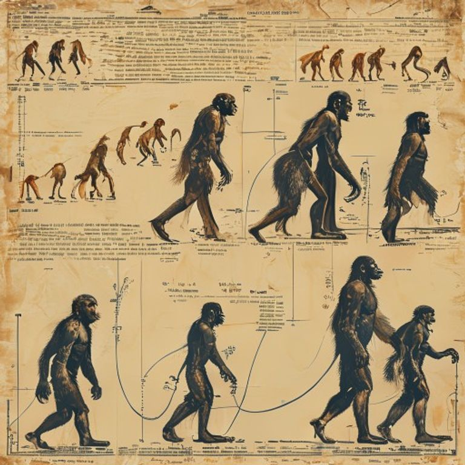
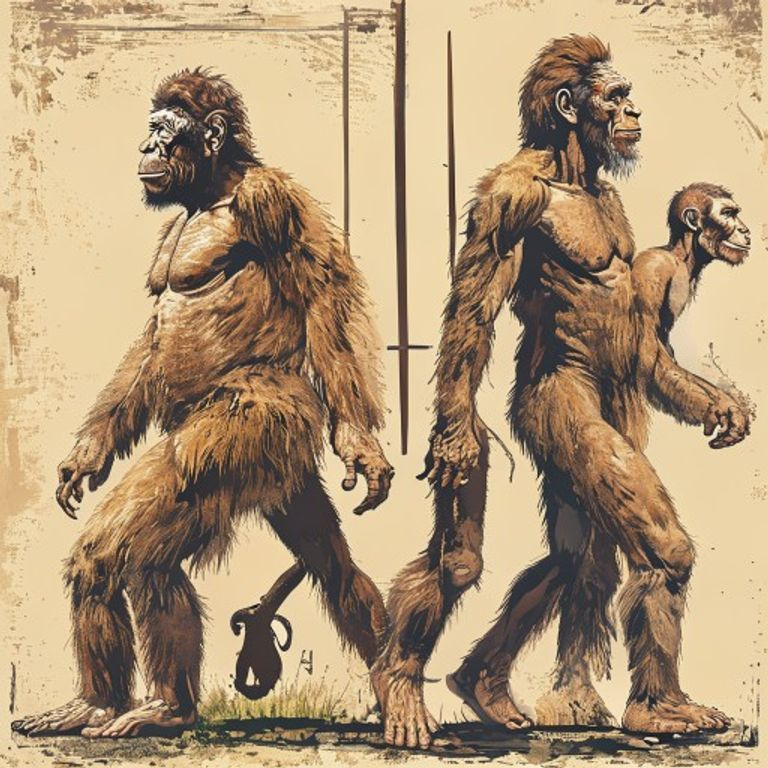
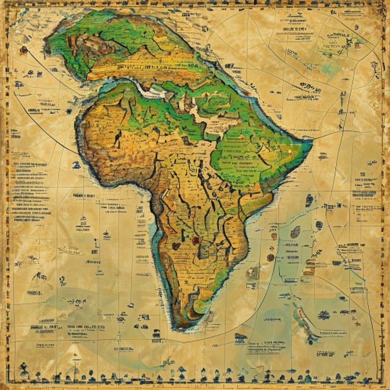

# The Evolution of Humans: A Comprehensive Overview
## Introduction to Human Evolution
Human evolution is a fundamental concept that explains how our species, Homo sapiens, emerged and developed over time. To understand this process, it's essential to start with the basics. 
* The definition of evolution refers to the scientifically supported theory that all species of life have developed from a common ancestor through the process of variation, mutation, genetic drift, and natural selection.
* The importance of evolution in human history cannot be overstated, as it has shaped our physical characteristics, behavior, and distribution across the globe.
* A brief overview of the human evolution timeline reveals a complex and still-unfolding story that spans millions of years, from the emergence of early hominins in Africa to the present day, with significant milestones including the development of bipedalism, brain expansion, and the migration of humans out of Africa to colonize other parts of the world.

*A diagram illustrating the major milestones in human evolution, from the emergence of early hominins to the present day.*
## Emergence of Early Humans
The emergence of early humans is a fascinating topic that has garnered significant attention from scientists and researchers. The fossil record provides valuable insights into the evolution of humans, with several key species playing a crucial role in this process. Some of the most notable early human species include:
* Australopithecus afarensis, which is believed to have lived around 3.9-2.9 million years ago and is known for its bipedalism, a characteristic that would become a hallmark of human evolution.
* Homo habilis, which emerged around 2.8-1.4 million years ago and is thought to have been the first species to use tools, marking a significant milestone in human development.
* Homo erectus, which lived from approximately 1.8 million to 70,000 years ago and is notable for its control of fire, more sophisticated tool use, and early migrations out of Africa. These species have helped shape our understanding of human evolution, and their discoveries have shed light on the complex and intriguing history of our species. By studying the fossil record and the characteristics of these early human species, we can gain a deeper appreciation for the remarkable journey that has led to the modern humans of today.

*An illustration of the key early human species, including Australopithecus afarensis, Homo habilis, and Homo erectus.*
## Development of Modern Humans
The development of modern humans is a complex and fascinating topic that has garnered significant attention from scientists and researchers. At the heart of this story is the emergence of *Homo sapiens*, a species that would eventually spread across the globe and give rise to the diverse range of cultures and populations we see today. 
The *Migration out of Africa* is believed to have occurred around 60,000-70,000 years ago, with early humans migrating to various parts of the world, including Asia, Europe, and Australia. 
As humans migrated and settled in different regions, they developed unique *language and culture*, shaped by their environment, geography, and interactions with other groups. 

*A map showing the migration routes of early humans out of Africa, including the spread to Asia, Europe, and Australia.*
## Impact of Environment on Human Evolution
The environment has played a significant role in shaping human evolution. Several factors have contributed to the adaptation and development of humans over time. 
* Climate change has been a major driver of human evolution, with changes in temperature and weather patterns forcing early humans to adapt to new conditions. 
* Geographic isolation has also had an impact, with populations becoming separated and developing distinct characteristics over time. 
* Adaptation to new environments has been crucial for human survival, with early humans migrating to new areas and developing new skills and technologies to cope with their surroundings. 
These factors have all contributed to the diversity of humans today, with different populations developing unique physical and cultural characteristics in response to their environment. 
Overall, the impact of environment on human evolution has been profound, shaping the course of human history and development. 
By understanding the role of environment in human evolution, we can gain a deeper appreciation for the complex and dynamic process that has shaped our species.
## Conclusion
The evolution of humans is a complex and fascinating topic. To summarize, the key takeaways from our overview include the emergence of early humans in Africa, migration to other parts of the world, and the development of distinct species such as Homo sapiens. Looking ahead, future directions in the study of human evolution may involve further research into genetic variations and their impact on human traits. Understanding human evolution is crucial as it provides insights into our shared history, helps us appreciate our diversity, and informs our approach to addressing global health issues and conservation efforts. By recognizing the importance of human evolution, we can better navigate our place in the world and make more informed decisions about our collective future.