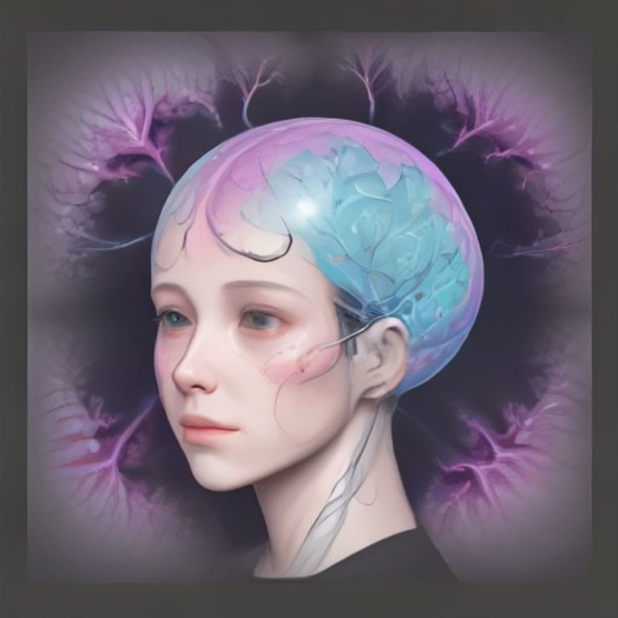

# The Human Brain: An Overview

## Anatomy of the Human Brain

The cerebral cortex is the brain’s outer layer, split into four lobes. The frontal lobe orchestrates planning, decision‑making, and language; the parietal lobe processes spatial and sensory information; the temporal lobe handles auditory perception and memory; and the occipital lobe decodes visual input. Together they support higher‑order cognition.

*Human brain anatomy: lobes and subcortical nuclei.*

Beneath the cortex, the cerebellum fine‑tunes movement and balance, adjusting motor commands in real time. The brainstem, a compact hub, controls breathing, heart rate, and arousal, ensuring survival‑critical functions run automatically.

Deep within, subcortical nuclei such as the hippocampus and amygdala encode memory, guide spatial navigation, and modulate emotions, linking experience to behavior through intricate neural pathways.

## Core Cognitive Functions

The visual cortex in the occipital lobe translates incoming light into shapes and colors, forming the basis for object recognition and spatial awareness.

[[IMAGE_2]]

In the frontal lobe, the prefrontal cortex coordinates executive functions—planning, working memory, and inhibitory control—enabling flexible adaptation to novel situations. Meanwhile, the basal ganglia, together with dopaminergic pathways, fine‑tune reward‑based learning; they adjust motivation and reinforce behaviors that yield positive outcomes. Together, these regions create a dynamic network that supports perception, memory, and decision‑making.