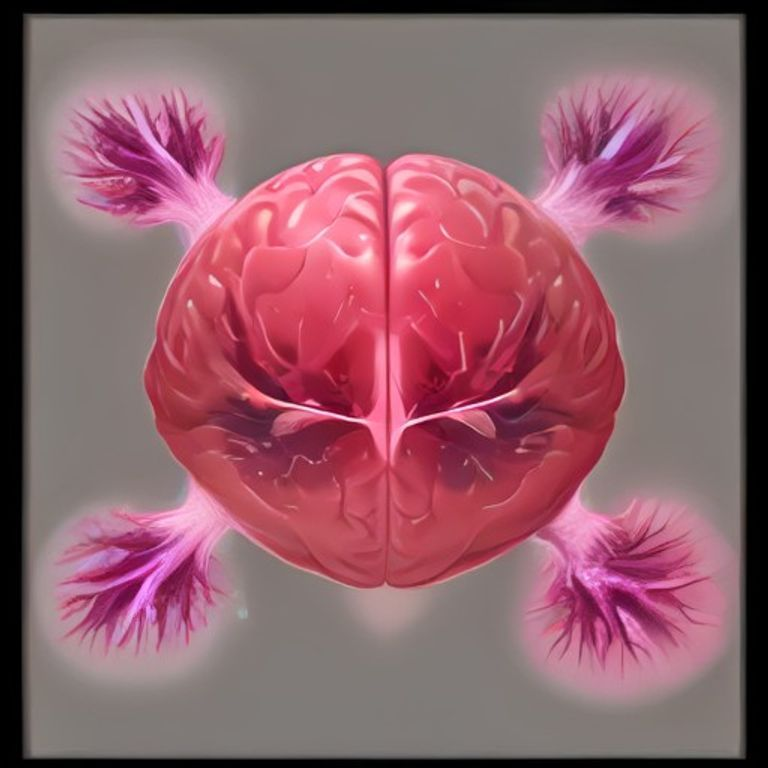
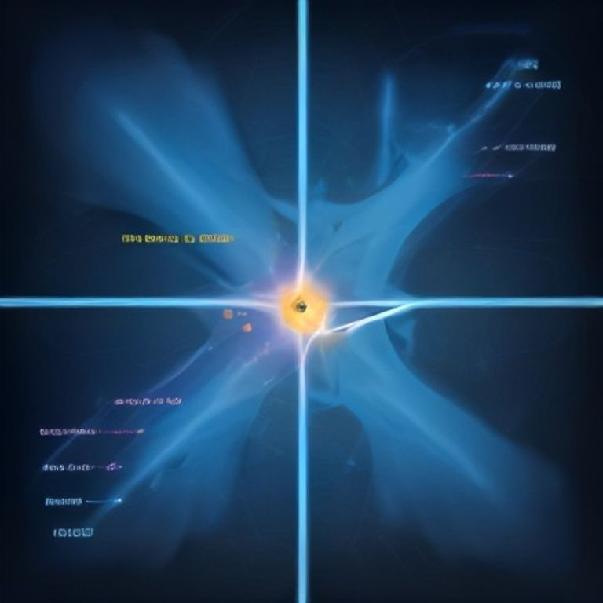

# The Human Brain: An Overview of Its Structure and Function

## Anatomy of the Brain

The brain is divided into three core components: the **cerebrum**, the largest part responsible for higher cognition; the **cerebellum**, which coordinates movement and balance; and the **brainstem**, the vital conduit for autonomic functions. The cerebrum is further segmented into four lobes. The **frontal lobe** sits at the front, governing decision‑making and motor control. The **parietal lobe** lies behind it, processing spatial and sensory information. The **temporal lobe** is positioned on the sides, handling hearing and memory, while the **occipital lobe** at the back manages visual perception. Blood reaches the brain through the internal carotid and vertebral arteries, and the protective meninges—dura mater, arachnoid, and pia mater—encase the entire organ.

*Figure 1: Overview of brain anatomy with labeled lobes*

## Key Functions of Major Regions

The brain’s lobes each specialize in distinct aspects of cognition, emotion, and movement. The frontal lobe sits at the front of the skull and is the command center for decision‑making, planning, and personality traits. The parietal lobe, located behind the frontal lobe, integrates sensory input and supports spatial awareness, allowing us to navigate and manipulate objects. The temporal lobe, near the temples, stores memories, processes language, and interprets sounds. Finally, the occipital lobe at the back of the head is dedicated to visual perception, translating light into the images we see.

## Neuronal Communication Basics

Neurons transmit signals through a tightly coordinated sequence of electrical and chemical events. First, an **action potential**—a rapid, self‑propagating voltage spike—travels down the axon, triggered when the membrane potential reaches a threshold. At the axon terminal, the action potential opens voltage‑gated calcium channels, allowing Ca²⁺ influx. This calcium surge prompts synaptic vesicles to fuse with the presynaptic membrane, releasing neurotransmitters into the synaptic cleft. The neurotransmitters bind receptors on the postsynaptic neuron, generating either excitatory or inhibitory postsynaptic potentials that can summate to trigger another action potential. Over time, repeated activity reshapes these connections, a process known as **neuroplasticity**, enabling the brain to strengthen, weaken, or form new synapses in response to experience.

*Figure 2: Neuronal communication process*

## Common Misconceptions About the Brain

The **10 % myth** is false; neuroimaging shows that all brain regions are active at some point during daily life. The **left‑brain/right‑brain** dichotomy oversimplifies lateralization; most functions involve both hemispheres working together. The idea that **brain size equals intelligence** is weak; cognitive ability depends more on connectivity and efficiency than on volume. These myths persist because they are easy to remember, but modern neuroscience demonstrates that brain function is far more complex and integrated than popular culture suggests.

## Future Directions in Brain Research

Emerging technologies are reshaping our understanding of the brain. Brain‑computer interfaces (BCIs) promise real‑time translation of neural signals into commands for prosthetics, communication aids, and immersive virtual environments, raising questions about neuroethics and data security. Connectomics seeks to chart the entire human connectome, enabling a systems‑level view of how micro‑circuits give rise to cognition and disease, yet the sheer scale of synaptic mapping remains a computational hurdle. Parallelly, artificial‑intelligence models that emulate cortical architectures—deep neural networks, spiking‑neuron simulators—offer testbeds for hypotheses about learning and memory, while also challenging us to reconcile biological plausibility with algorithmic efficiency.